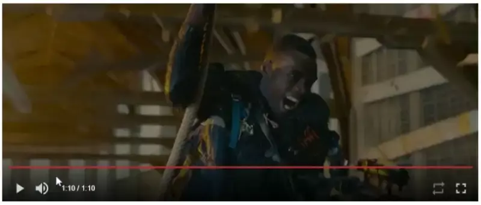

YT Player
=======
<a href="https://badge.fury.io/js/%40vladjerca%2Fyt-player">
  
</a>

## Development Notes

1. Install `npm i @vladjerca/yt-player`


## Themeing

Just import the theming file in your main `scss`.

```scss
@import "~@vladjerca/player/theming";

$theme: (
  player: (
    progress: #c0392b
  )
);

@include yt-theme($theme);

```

## Component Usage

`app.module` configuration

```ts
import { YtPlayerModule } from '@vladjerca/yt-player';


@NgModule({
  imports: [
    YtPlayerModule,
  ]
})
export class AppModule { }

### Video Player

```

`markup`

``` html
<!-- Video source file, accepted formats: mp4, ogv, webm. -->
<yt-video-player>
  <yt-source [src]="video.mp4"></yt-source>
  <yt-source [src]="video.ogg"></yt-source>
  <yt-source [src]="video.webm"></yt-source>
</yt-video-player>
```

API:

```ts
@Input()
muted: boolean;

@Input()
preload: PreloadStrategy;

@Input()
autoplay: boolean;

@Input()
loop: boolean;
```

### Video Player

`markup`

``` html
<!-- Video source file, accepted formats: mp4, ogv, webm. -->
<yt-image-player [images]="[
                            'http://localhost/frame01.jpg',
                            'http://localhost/frame02.jpg',
                            'http://localhost/frame03.jpg',
                            'http://localhost/frame04.jpg',
                            'http://localhost/frame05.jpg'
                          ]"
                  [fps]="1">
</yt-image-player>
```

API:

```ts
@Input()
images: string[];

@Input()
fps: number;

@Input()
preload: PreloadStrategy;

@Input()
autoplay: boolean;

@Input()
loop: boolean;
```

## Thanks go to `@iandevlin` for his `mdn` video player 🎊

<a href="https://github.com/iandevlin">
  
</a>


## Preview


